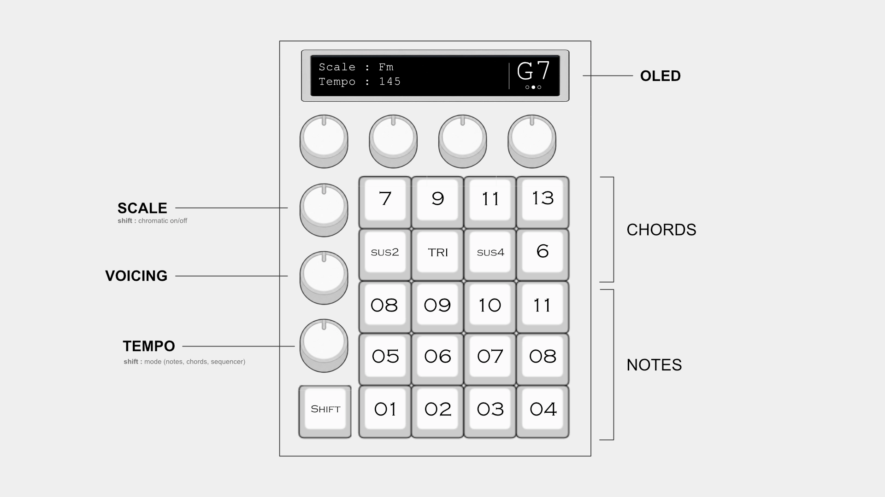

# SYNTH_01

SYNTH_01 is an ongoing project to design and build a compact hardware instrument for creating notes, chords, and simple sequences.

_01 hardware concept](SYNTH_01.webp)

The image above is the current hardware concept: a 4 x 4 performance grid, dedicated chord controls, three encoders for scale, voicing, and tempo, plus an OLED display for the current musical state.

## Current state

The project is currently at the audio-engine prototype stage. The C++ program can:

- generate sine, square, triangle, and sawtooth waveforms;
- convert MIDI note numbers into frequencies;
- map a 16-key input across a chromatic octave range;
- apply an ADSR-style envelope;
- write the result as a mono 16-bit, 48 kHz WAV file.

Running the prototype creates `audioData.wav` using the values currently set in `main.cpp`. The physical controls and real-time hardware audio engine are not implemented yet.

## Hardware objective

The long-term goal is a standalone instrument with a simple, playable interface:

- 16 buttons for notes and chord shapes;
- a scale selector with chromatic mode;
- voicing control for chord construction;
- tempo control for note, chord, and sequencer modes;
- an OLED display showing the active scale, tempo, and current note or chord.

The exact electronics and microcontroller platform are still to be decided. This repository is being used to develop and test the synthesis and musical-logic foundations before translating them into hardware.

This is an experimental work in progress.
