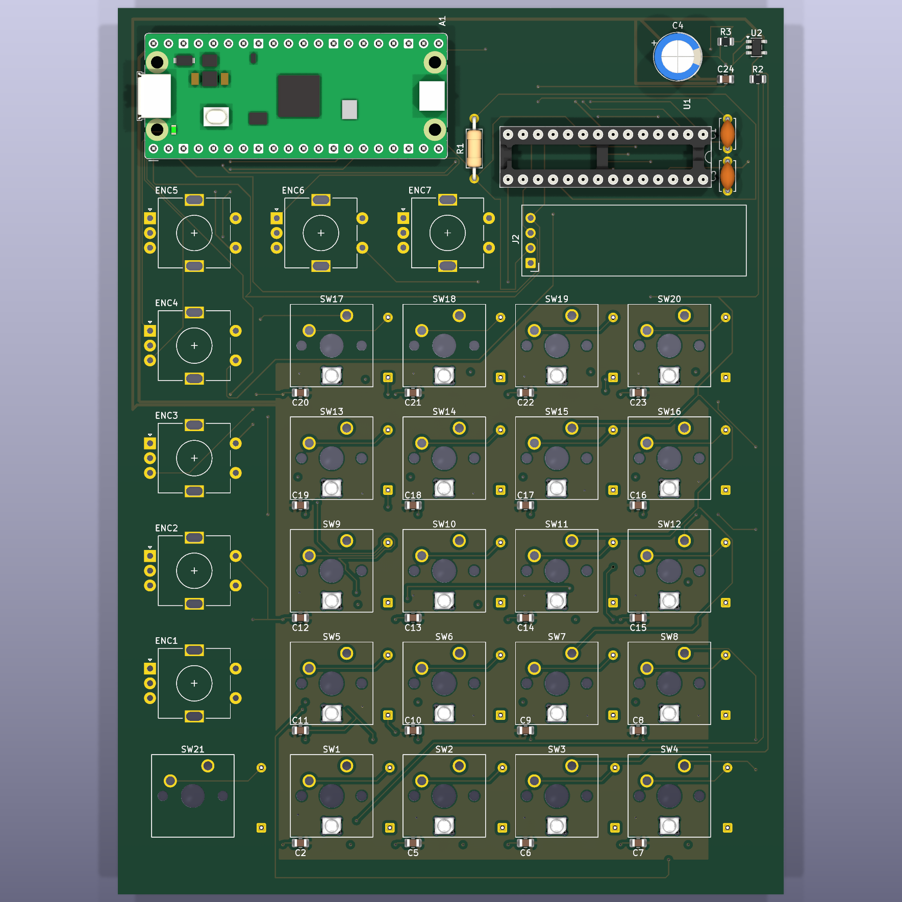
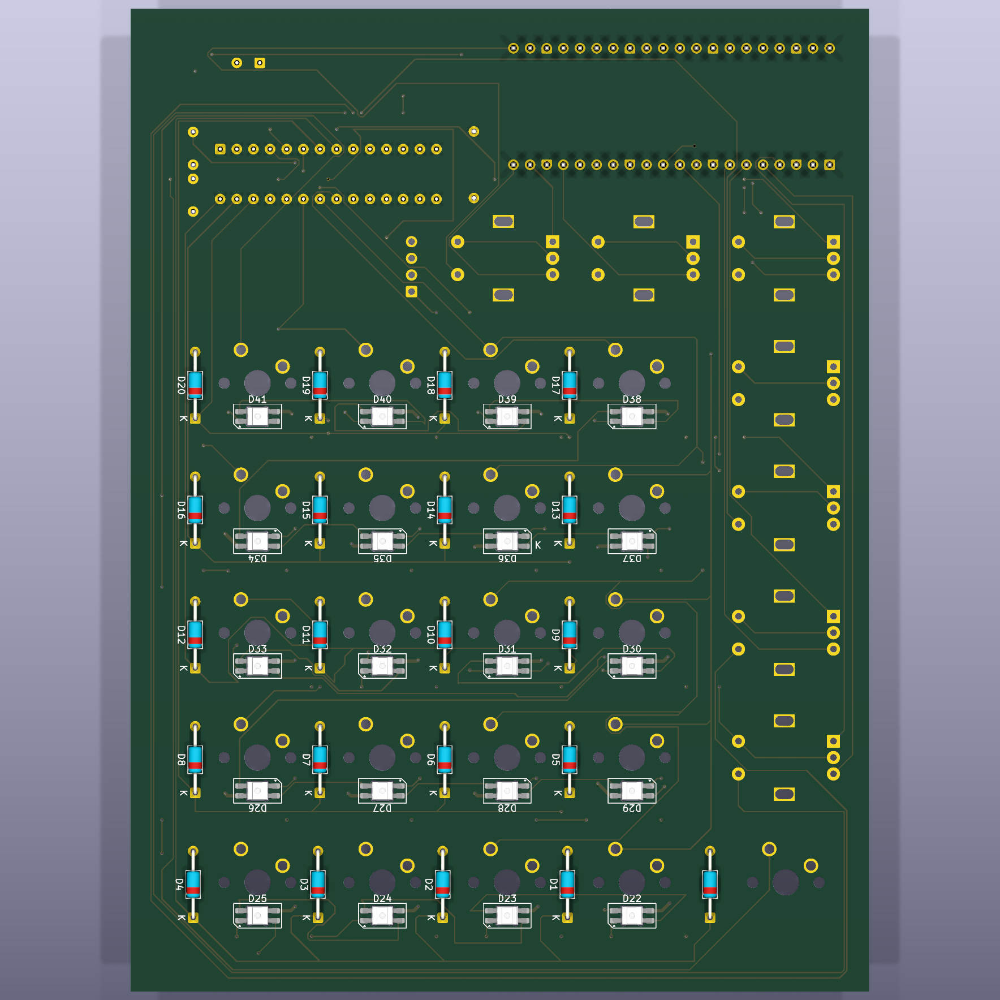

# AKOR_01

AKOR_01 is a compact hardware controller for playing notes, chords, and simple sequences.

## PCB preview

### Front

### Back

The confirmed V0 interface contains a 4 × 5 performance grid plus Shift (21 MX switches total), seven push encoders, and an OLED display.

## Architecture locked on 2026-07-31

**V0 is an independent USB-MIDI controller based on Raspberry Pi Pico 2 H.**

A future standalone synthesizer is a separate V2 project. V2 is intentionally not a compatibility constraint for the V0 PCB.

### V0 hardware target

- Raspberry Pi Pico 2 H as the USB-MIDI device and control processor;
- 21 MX-compatible switches and 21 × 1N4148 in a scanned matrix;
- 7 bare EC11-style encoders with integrated push switches;
- 1 × MCP23017 I²C GPIO expander;
- 1 × SSD1306-compatible I²C OLED module;
- no onboard audio or DSP output stage.

The intended signal allocation is:

- encoder `A/B`: 14 direct Pico GPIO inputs;
- one encoder push switch: one direct Pico GPIO input;
- matrix rows/columns plus six encoder push switches: one MCP23017;
- OLED and MCP23017: shared 3.3 V I²C bus;
- USB: Pico 2 H onboard micro-USB, carrying power and class-compliant MIDI.

## Software state

The existing C++ prototype can:

- generate sine, square, triangle, and sawtooth waveforms;
- convert MIDI note numbers into frequencies;
- map a 16-key input across a chromatic octave range;
- apply an ADSR-style envelope;
- write mono 16-bit, 48 kHz WAV output.

That offline audio work is preserved for the separate V2. The V0 software goal is musical-state handling, control scanning, OLED feedback, and USB MIDI Note On/Off/Panic.

## Fabrication status

The PCB is routed and the latest KiCad DRC reports zero electrical errors and zero unconnected items after refilling zones. Eighteen non-blocking warnings remain around silkscreen placement and one library-footprint mismatch.

Do not send the board for fabrication until the final manufacturing review has checked the remaining warnings, reverse-mount geometry, solder-mask and courtyard clearances, board edges, mechanical fit, and Gerber/drill outputs.
